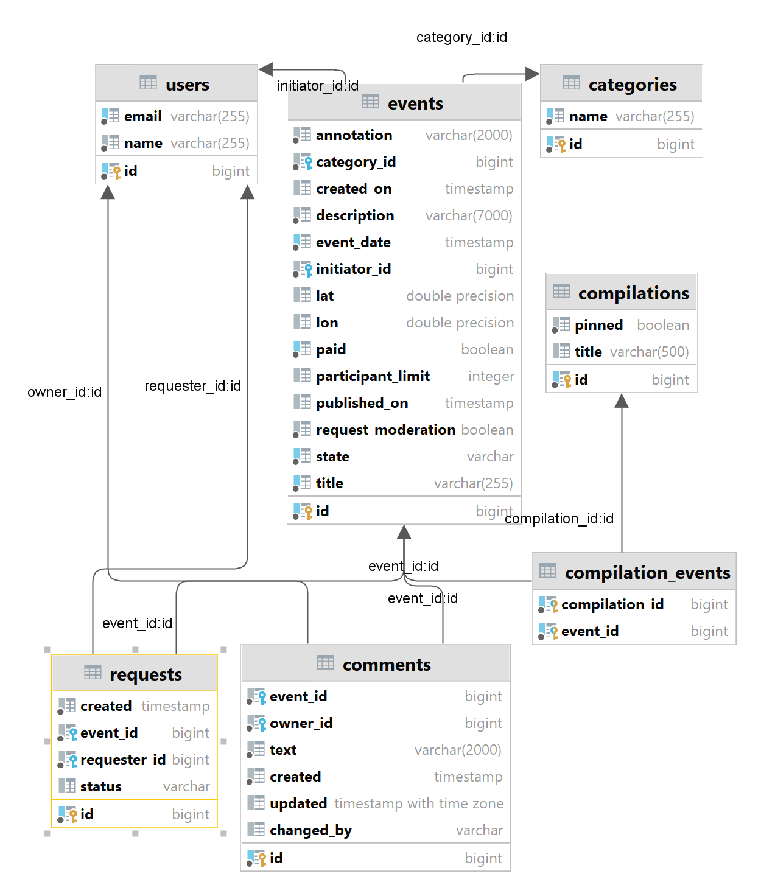

java-explore-with-me
### Описание
Двухмодульное приложение для размещения и поиска событий-мероприятий.

Приложение состоит из основного сервиса, основной БД, сервиса статистики, БД для статистики. 
Каждая часть поднимается в отдельном docker-контейнере.
[Ссылка на финальный PR](https://github.com/StRaiGT/java-explore-with-me/pull/3)https://github.com/chugunse/java-explore-with-me/pull/5

### Стек:
- Java 11 (Core, Collections, Optional, Stream)
- Spring Boot
- Hibernate
- PostgreSQL
- Maven
- Lombok
- Postman
- Docker

## Endpoints
- [Техническое задание для API основного сервиса](./ewm-main-service-spec.json)
- [Техническое задание для API сервиса статистики](./ewm-stats-service-spec.json)
- В качестве дополнительной фичи реализован функционал комментариев.

### Comments
Admin
'[PATCH] /admin/comments/{commentId}' обновление комментария
'[DELETE] /admin/comments/{commentId}' удаление комментария
Private
'[POST] /users/{userId}/comments?eventId={eventId}' добавление комментария
'[PATCH] /users/{userId}/comments/{commentId}?eventId={eventId}' обновление комментария
'[DELETE] /users/{userId}/comments/{commentId}?eventId={eventId}' удаление комментария
Public
'[GET] /events/{eventId}/comments/{commentId}' получить комментарий
'[GET] /events/{eventId}/comments/{commentId}?from={from}&size={size}' получить список комментариев к событию

## Схема базы данных основного сервиса
